# 2.0 Administration Menu

There are four options on top:

|Option|	Action|
|---|---|
|Preferences|	Here you can configure your preferences for the module|
|Update|	Click here if you’ve made some changes to the module, uploaded new files, etc. – this will recompile the module and update all entries in the database |
|Blocks|	When you click here, it will redirect you to the Blocks section of XOOPS, and select the blocks related to your module|
|Templates|	This will open for you the template editor window|
|Comments|	Here you can view comments related to this module|
|Unistall|	Click here to easily uninstall the module. Very handy in testing|
|Go to module|	If the module is visible on the user side, this will take you there|

In the Admin Menu, there are following key menu Tabs:

* Index
* Categories
* Forums
* Permissions
* Order
* Prune
* Reports
* Digest
* Votes
* Topic types
* Group Moderate
* Sync Forums
* About

Let's explore in detail each of them:

#### Index

In this tab you can see the statistics about the module, incl. number of Topics, number of Posts, and how many views you had on the NewBB. 

You can also see if there are any Pending reports.

####  Categories
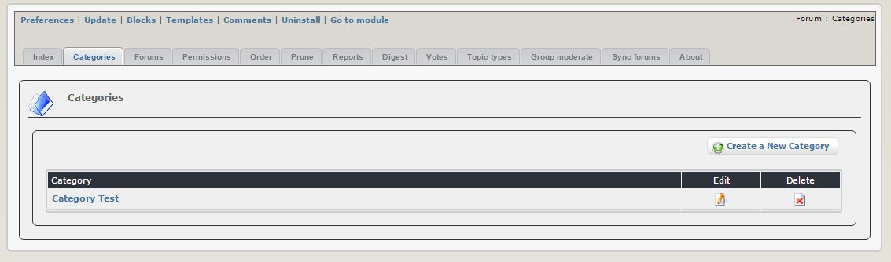

This Tab gives you an overview of your Categories. You have also a button to create a new Category, if needed, which opens the form below:

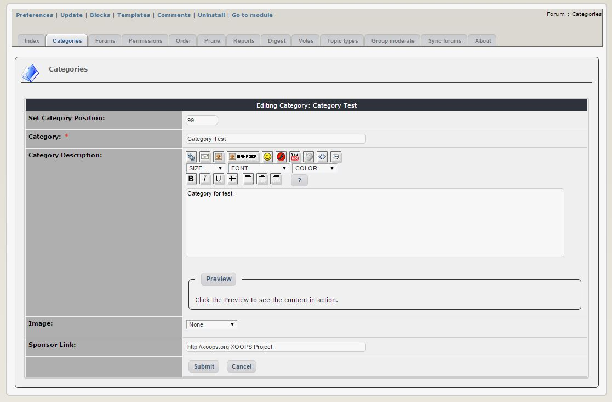

You will need to fill out the form and save it, in order to create the new category. The same form is also used for editing existing Categories.

####  Forums

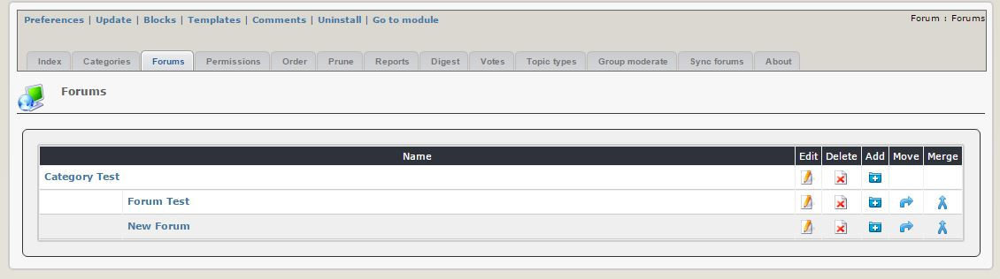

For each Category, you can create Forums and Sub-Forums, and the "Forums" Tab gives you the overview of the available Forums. In addition to creating new Forums and Sub-Forums, you can also "move" and "merge" existing forums. 

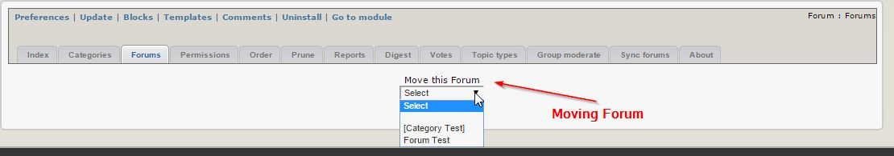

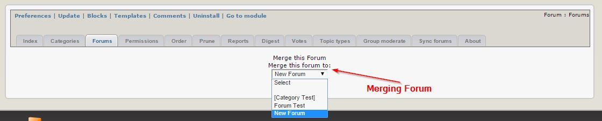

To create a new Forum, you need to fill-out this form that will open after you click on the "Add" button:

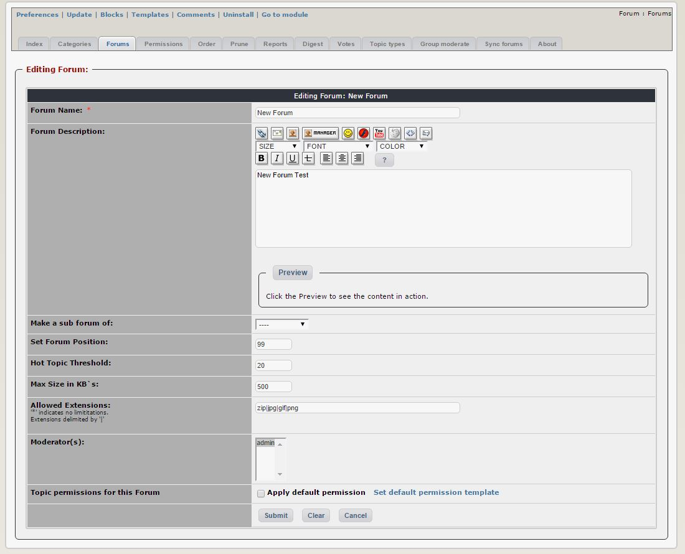

 You can use existing "Default Permissions" for your new forum, which will save you a lot of time. You will learn how to set the permissions below.

####  Permissions

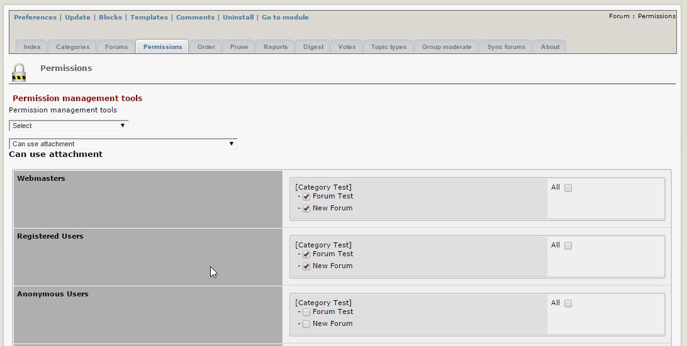

When you go to the Permissions tab, as first you'll see in the left column list of available Groups (normally: Webmaster, Registered Users, and Anonymous Users), and on the right list of available Categories and Forums. 

You can select individual "activity" from the list below by clicking on the drop-down menu:

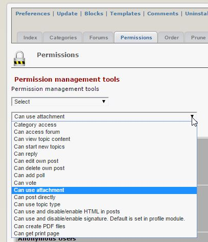

and then select for each Group and each Category/Forum the appropriate permission.

If you have the same level of permissions for all Groups and for all Categories/Forums, you can define a "Default" set of Permissions, that you can reuse for all new and existing forums. This makes the management of Permissions much easier, while still allowing you to customize it as needed.

This powerful Permissions system is one of the strongest points of XOOPS, as you can reuse it in all modules, and you can assign individual permissions at a very granular level.   

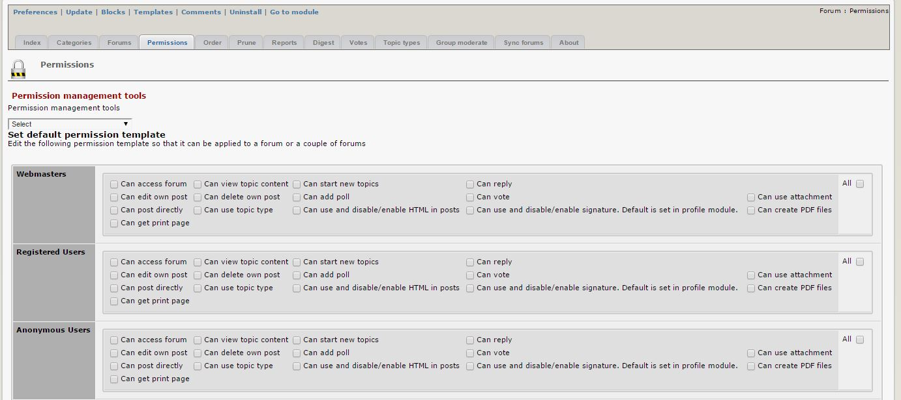

####  Order

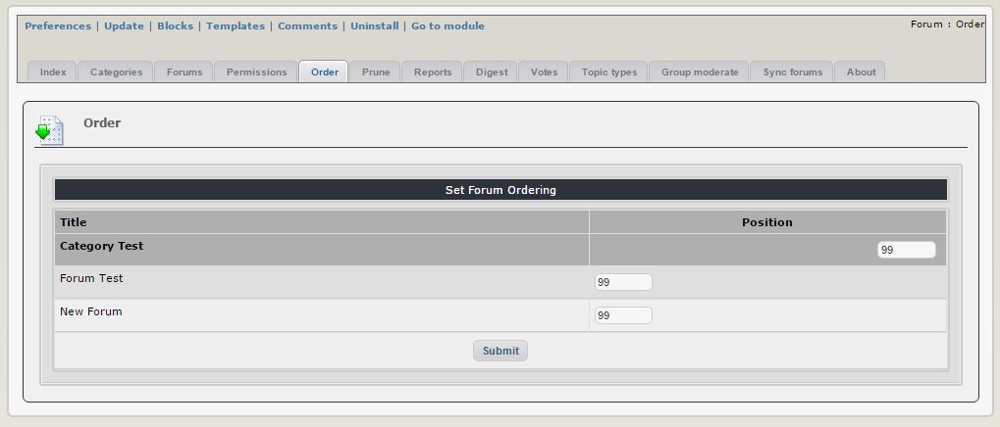

Here you can reorder the Forums within each Category. 

As you remember, in the Forums Tab, you can also move and merge the Forums. 

####  Prune

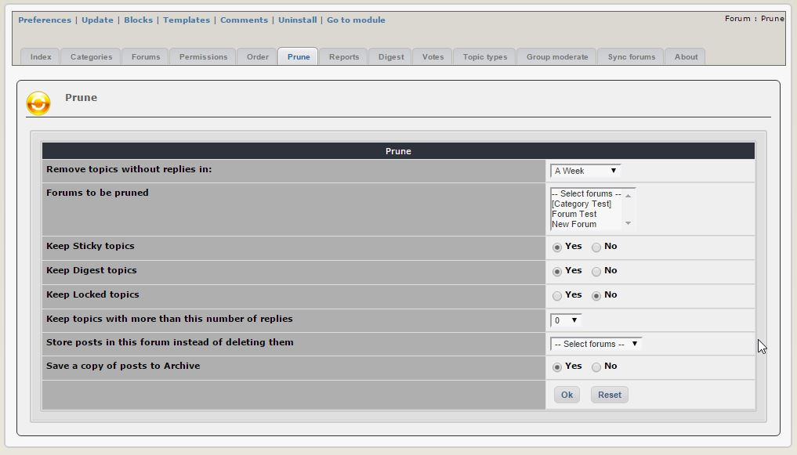

Sometimes you might decide that some of the Topics and/or messages are outdated, and you need to do a Clean-up!  That's where the Prune tab is coming very handy. You can select the topics that you would like to remove, and you can do it in very granular level. 

Instead of just deleting them, you can also move them to a specific location (e.g. you can create an "Archive Forum" and move them there, so you can keep them for future references, if needed. 

####  Reports
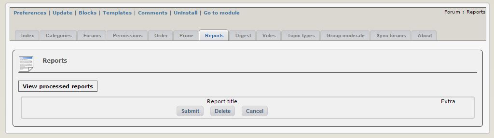

####  Digest

####  Votes

####  Topic types

####  Group Moderate

####  Sync Forums

####  About