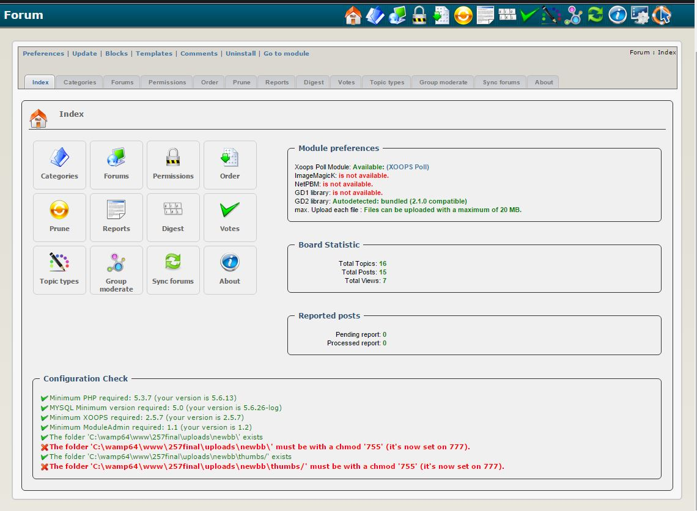

# 2.0 Administration Menu

There are four options on top:

|Option|	Action|
|---|---|
|Preferences|	Here you can configure your preferences for the module|
|Update|	Click here if you’ve made some changes to the module, uploaded new files, etc. – this will recompile the module and update all entries in the database |
|Blocks|	When you click here, it will redirect you to the Blocks section of XOOPS, and select the blocks related to your module|
|Templates|	This will open for you the template editor window|
|Comments|	Here you can view comments related to this module|
|Unistall|	Click here to easily uninstall the module. Very handy in testing|
|Go to module|	If the module is visible on the user side, this will take you there|

In the Admin Menu, there are following key menu Tabs:

* Index
* Categories
* Forums
* Permissions
* Order
* Prune
* Reports
* Digest
* Votes
* Topic types
* Group Moderate
* Sync Forums
* About
