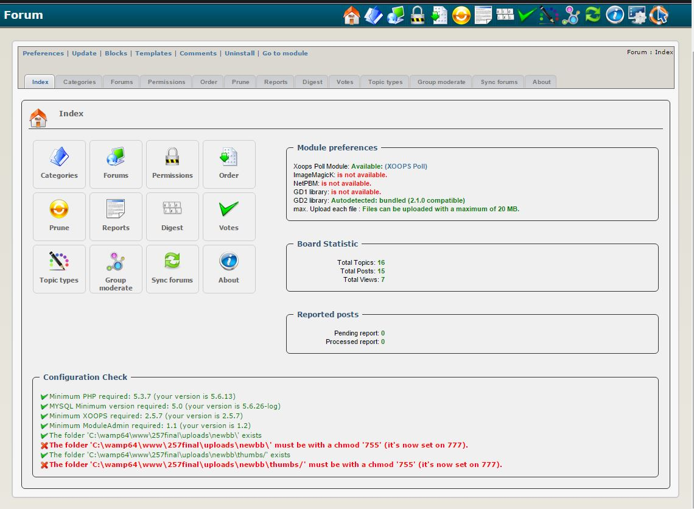

### _XOOPS Documentation Series_

# Module NewBB (Discussion Forums)
#### for XOOPS 2.5.7
      

            
## User Manual

© 2015 The XOOPS Project ([www.xoops.org](www.xoops.org))    

## Module Purpose 

This module is for creating a Discussion Forums, aka BBS (Bulletin Boards).

*Figure 1: Main view of the NewBB Module (Admin side)*

### Key Features

* Extensive Permission/Moderation System
* User-friendly  Admin Interface
* Reorder Categories, Forums and Subforums
* Subforums
* Attachments (can show Pictures directly)
* Add Poll to Topic
* Prune System
* Digest System
* Karma system
* Experience Level system
* Thread Rating Function
* Editing and deleting can have a timelimit.
* Possible to allow Post only after a Timelimit (next post i.e. 30 sec from same User)
* Moderate a Group (Post need to be approved before displaying )
* Choice between Realname or Nickname
* Fulltext Notification
* Topic Subject Prefix
* In Blocks you can select which Forum or Forums to display
* Print Thread
* RSS Feed
* Collapsing Categories and Fastreply Box ( Cookie will remember Position )
* Can mark all topics as read
* Disclaimer (Choose to display Reply / Post / Both / None)
* Reply first before seeing the other replies

## Download/Fork the Module  

**You can fork the module --> [here](https://github.com/XoopsModules25x/newbb))** 

## How to Contribute

[You can contribute on GitHub](https://github.com/XoopsDocs/newbb-tutorial). Changes will be [pushed to Gitbook.io automatically](https://www.gitbook.com/book/xoops/newbb-tutorial/activity) when the [main repository](https://github.com/XoopsDocs/newbb-tutorial) changes.

Editing the book can be done either by updating the markdown files with a text editor, or opening the repository in [the Gitbook desktop app](https://github.com/GitbookIO/editor/blob/master/README.md). The desktop app will give you a live preview option.

# Table of Content

* [Install/Uninstall](book/1install.md)
* [Administration Menu](book/2administration.md)
* [Preferences](book/3preferences.md)
* [Operating Instructions](book/4operations.md)
* [The User Side](book/5userside.md)
* [Blocks](book/6blocks.md)
* [Templates](book/7templates.md)
* [Miscellaneous](book/8other.md) 
* [Module Credits](book/9credits.md)
* [About XOOPS CMS](book/10aboutxoops.md)

## License:

 Unless specified, this content is licensed under a <a rel="license" href="http://creativecommons.org/licenses/by-nc-sa/4.0/">Creative Commons Attribution-NonCommercial-ShareAlike 4.0 International License</a>.

All derivative works are to be attributed to XOOPS Project ([www.xoops.org](https://xoops.org))
