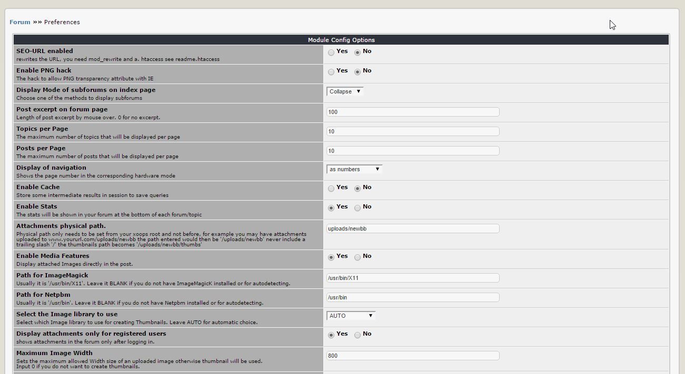

# 3.0 Preferences

In the Preferences, you can set the most important options for the module, such as the number of visible Topics per page.

  

**Figure 12 The Preferences options**

### Module configuration options

|Option|Description|
|---|---|
|SEO-URL enabled |rewrites the URL, you need mod_rewrite and a. htaccess see readme.htaccess	|
|Enable PNG hack|The hack to allow PNG transparency attribute with IE|
|Display Mode of subforums on index page|Choose one of the methods to display subforums|
|Post excerpt on forum page|Length of post excerpt by mouse over. 0 for no excerpt.|
|Topics per Page|The maximum number of topics that will be displayed per page|
|Posts per Page|The maximum number of posts that will be displayed per page|
|Display of navigation|Shows the page number in the corresponding hardware mode|
|Enable Cache|Store some intermediate results in session to save queries|
|Enable Stats|The stats will be shown in your forum at the bottom of each forum/topic|
|Attachments physical path.|Physical path only needs to be set from your xoops root and not before, for example you may have attachments uploaded to www.yoururl.com/uploads/newbb the path entered would then be '/uploads/newbb' never include a trailing slash '/' the thumbnails path becomes '/uploads/newbb/thumbs'|
|Enable Media Features|Display attached Images directly in the post.|
|Path for ImageMagick|Usually it is '/usr/bin/X11'. Leave it BLANK if you do not have ImageMagicK installed or for autodetecting.|
|Path for Netpbm|Usually it is '/usr/bin'. Leave it BLANK if you do not have Netpbm installed or for autodetecting.|
|Select the Image library to use|Select which Image library to use for creating Thumbnails. Leave AUTO for automatic choice.|
|Display attachments only for registered users|shows attachments in the forum only after logging in.|
|Maximum Image Width|Sets the maximum allowed Width size of an uploaded image otherwise thumbnail will be used. Input 0 if you do not want to create thumbnails.|
|Maximum height of an image|Sets the maximum allowed height of an uploaded image.|
|Maximum Image Width for creating thumbnail|Sets the maximum width of an uploaded image to create thumbnail. Image with width larger than the value will not use thumbnail.|
|Maximum Image Height for creating thumbnail|Sets the maximum height of an uploaded image to create thumbnail. Image with height larger than the value will not use thumbnail.
|Enable Who's Online|Enable Who's Online Block shown below the Index page and the Forum pages|
|HP/MP/EXP Level Mode|HP is determined by your average posts per day. MP is determined by your join date related to your post count. EXP goes up each time you post, and when you get to 100%, you gain a level and the EXP drops to 0 again.|
|Show Real Name|Replace username with user's real name.|
|Enable Group bar|Display the Groups of the User in the Post info field.|
|Enable Rating Function|Allow Topic Rating|
|Report a Post|User can report posts to Moderator(s), for any reason, which enables Moderator(s) to take action|
|Enable Quick reply|This will enable the Quick reply form|
|Enable RSS Feed|Enable RSS Feed, edit options below for maximum Items and Description length|
|RSS Max. Items	||
|RSS Max. Description Length||
|RSS Feed cache time|Cache time for re-generating RSS feed, in minutes.|
|Show Infobox|Infobox contains information about the user (joining date, number of posts,...)|
|Show social links|Show sharing buttons on the bottom of each post|
|Show Advertising|shows a commercial break after the 2nd Thread|
|Show Jumpbox|If Enabled, a drop-down menu will allow users to jump to another forum from a forum or topic|
|Show Permission Table|Setting YES will display user's right|
|Email post digest|Set time period for sending post digest to users|
|Show user IP|Setting YES will show users IP to moderators|
|Enable karma requirement|This allows user to set a karma requirement for other users reading his/her post|
|Karma options for post|Use ', ' as delimiter for multi-options.|
|'Since' options for creating a selection box in 'viewform.php', 'list.topic.php' and 'search.php'|Positive value for days and negative value for hours. Use
|'Since' default value in selection box|Default value in the selection box if not specified by users. Positive value for days and negative value for hours. (0=From the beginning) (365=From the last year)|
|Allow registered users to post anonymously|This allows a logged in user to post anonymously|
|Prefix for anonymous user|This will add a prefix to the anonymous username while posting|
|Allow requiring reply to read a post|This feature forces readers to reply to the original posters post before being able to read the original|
|Time limit for edit a post|Set a Time limit for user editing their own post. In minutes, 0 for no limit|
|Timelimit for recording edit info|Set a Timelimit for waiving recording edit info. In minutes, 0 for no limit|
|Time limit for deleting a Post|Set a Time limit for user deleting their own post. In minutes, 0 for no limit|
|Time limit for consecutively posting|Set a Time limit for consecutively posting. In seconds, 0 for no limit|
|Check permission|Check permission for edit on display page|
|Enable user moderation|Forum moderator can suspend a specific user for a specific time period in the forum.| 
|Show Disclaimer|Enter your Disclaimer that will be shown for the above selected option. Current default is: The forum contains a lot of posts with a lot of useful information.  In order to keep the number of double-posts to a minimum, we would like to ask you to use the forum search before posting your questions here.|
|Forum for welcoming new user|A profile post will be published when a user visits Forum module for the first time|
|Xoops Poll Module|Xoops Poll Module|
|Enable Notification|This module allows users to be notified when certain events occur. Select if users should be presented with notification options in a Block (Block-style), within the module (Inline-style), or both. For block-style notification, the Notification Options block must be enabled for this module.|
|Enable Specific Events|Select which notification events to which your users may subscribe.|