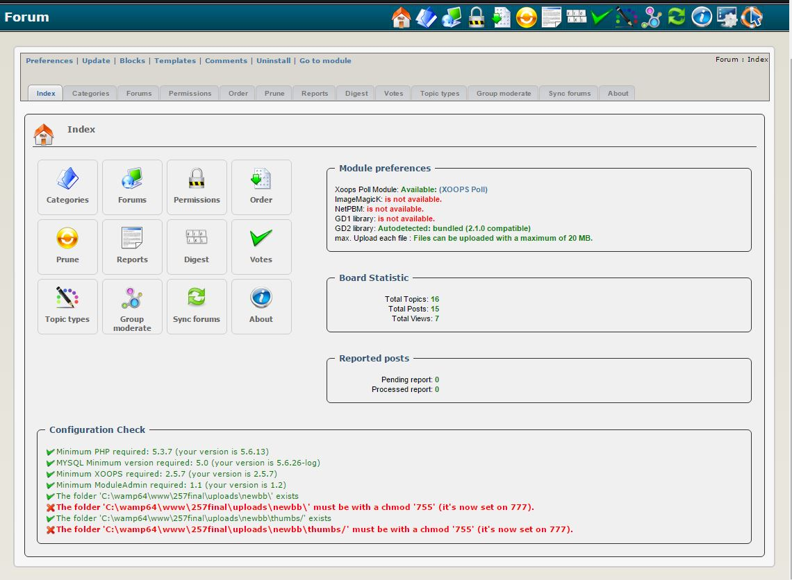

### _XOOPS Documentation Series_

# Модуль NewBB (Форумы)
#### для XOOPS 2.5.9
      

            
## Руководство пользователя

© 2017 The XOOPS Project ([www.xoops.org](www.xoops.org))    

## Назначение модуля 

Этот модуль предназначен для создания дискуссионных форумов, а также BBS (бюллетеней).

*Фигура 1: Основной вид модуля NewBB (сторона администратора)*

### Ключевые особенности

* Обширная система разрешения/модерации
* Удобный интерфейс администратора
* Управление порядком категорий, форумов и подфорумов
* Подфорумы
* Вложения (можно напрямую показывать изображения)
* Добавить опрос в тему
* Очистка системы
* Система интересных сообщений
* Система кармы
* Система уровня опыта
* Рейтинги тем
* Редактирование и удаление сообщений могут иметь ограничение по времени.
* Можно ограничить публикацию сообщений лимитом времени (например следующее сообщение пользователь сможет опубликовать только через 30 секунд)
* Модерирование групп (сообщение должно быть одобрено перед публикацией)
* Выбор между реальным именем или псевдонимом
* Полнотекстовое уведомление
* Предмат темы может иметь свой префикс
* В блоках Вы можете выбрать, какой форум или форумы показать
* Печать темы
* RSS лента
* Свернуть категории и блок быстрого ответа (Cookie будет помнить позицию)
* Можно отметить все темы как прочитанные
* Отказ от ответственности (выберите для показа Ответить/Сообщение/Оба/Нет)
* Ответ прежде, чем увидеть другие ответы

## Загрузить/Вилка модуль  

**Вы можете разветвить модуль --> [здесь](https://github.com/XoopsModules25x/newbb))** 

## Как внести вклад

[Вы можете участвовать в GitHub](https://github.com/XoopsDocs/newbb-tutorial). Изменения будут [применены на Gitbook.io автоматически](https://www.gitbook.com/book/xoops/newbb-tutorial/activity) когда [основной репозиторий](https://github.com/XoopsDocs/newbb-tutorial) изменения.

Редактирование книги может быть выполнено либо путем обновления файлов разметки с помощью текстового редактора, либо открытия репозитория в [настольном приложении Gitbook](https://github.com/GitbookIO/editor/blob/master/README.md). Приложение для настольных компьютеров предоставит Вам возможность предварительного просмотра.

# Содержание

* [Установка/Удаление](book/1install.md)
* [Меню администратора](book/2administration.md)
* [Настройки](book/3preferences.md)
* [Инструкция по эксплуатации](book/4operations.md)
* [Сторона пользователя](book/5userside.md)
* [Блоки](book/6blocks.md)
* [Шаблоны](book/7templates.md)
* [Другое](book/8other.md)
* [Module Credits](book/9credits.md)
* [About XOOPS CMS](book/10aboutxoops.md)

##Лицензия:

 Если это не указано, этот контент лицензируется в соответствии с <a rel="license" href="http://creativecommons.org/licenses/by-nc-sa/4.0/">Creative Commons Attribution-NonCommercial-ShareAlike 4.0 International License</a>.

Все производные работы должны быть отнесены к проекту XOOPS ([www.xoops.org](https://xoops.org))
