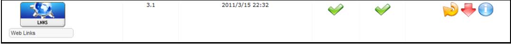

# 1.0 Установка/Удаление

1. Установка следует обычной процедуре XOOPS. После загрузки дистрибутива модуля распакуйте файлы и откройте папку и любую вложенную папку ниже, пока не найдете файлы основного модуля. Родительская папка будет загружена на ваш сервер в каталог 'Modules'. Теперь откройте и просмотрите 'Readme' или измените файлы изменений и следуйте указаниям. Для этого модуля нет предустановленных конфигураций.    
2. Используя обычный FTP-клиент, загрузите в него каталог 'newbb' в каталог файлов Вашего сайта 'modules'.   
3. Откройте страницу администрирования своего веб-сайта и перейдите к 'Модули', и нажмите кноку "Установить модуль" (Смотри ниже). 
 
  

**Фигура 2 Администрирование и установка модуля**

4.
Установите модуль, щелкнув ссылку установки. Страница подтверждения должна предоставить Вам ссылку на 'страница администрирования модуля'

5.
Подробные инструкции по установке модулей доступны в руководстве по эксплуатации XOOPS. 
Чтобы удалить модуль, просто нажмите на красную стрелку:

  

**Фигура 3 Администрирование и удаление модуля**
 
