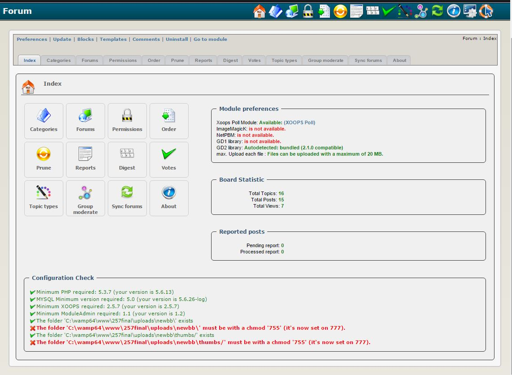

# 2.0 Меню администрирования

Вариант меню сверху:

|Опции|	Действие|
|---|---|
|Настройки|	Здесь Вы можете установить свои настройки для модуля|
|Обновление|	Нажмите здесь, если вы внесли некоторые изменения в модуль, загрузили новые файлы и т.д. – это позволит перекомпилировать модуль и обновить все записи в базе данных |
|Блоки|	Когда Вы нажмете здесь, он перенаправит Вас в раздел Блоки XOOPS и выберет блоки, связанные с Вашим модулем|
|Шаблоны|	Это откроет для Вас окно редактора шаблонов|
|Комментарии|	Здесь Вы можете посмотреть комментарии, связанные с этим модулем|
|Удаление|	Нажмите здесь, чтобы удалить модуль. Очень удобно в тестировании|
|Перейти к модулю|	Если модуль виден на стороне пользователя, это приведет Вас туда|

В админ меню есть следующие пункты меню:

* Главная
* Категории
* Форумы
* Права доступа
* Порядок
* Очистка
* Отчеты
* Интересное
* Голосование
* Типы тем
* Группа модераторов
* Синхронизация фрумов
* О модуле
* Помощь

Давайте подробно рассмотрим каждый из них:

#### Главная

На этой вкладке Вы можете увидеть статистику о модуле, вкл. количество тем, количество сообщений и количество просмотров в NewBB. 

Вы также можете увидеть, есть ли ожидающие отчеты.

####  Категории

Эта вкладка дает Вам обзор Ваших категорий. Кроме того, у Вас есть кнопка для создания новой категории, которая открывает форму создания категории:

Вам нужно будет заполнить форму и сохранить ее, чтобы создать новую категорию. Такая же форма также используется для редактирования существующих категорий.

####  Форумы

Для каждой категории вы можете создавать форумы и под-форумы, а вкладка "Форумы" дает Вам обзор доступных форумов. Помимо создания новых форумов и под-форумов, Вы также можете "переместить" и "объеденить" существующие форумы. 

Чтобы создать новый форум, Вам необходимо заполнить эту форму, которая откроется после нажатия кнопки "Добавить":

 Вы можете использовать существующие "Разрешения по умолчанию" для своего нового форума, что сэкономит Вам много времени. Вы узнаете, как установить права доступа ниже.

####  Права доступа

Когда Вы перейдете на вкладку "Права доступа", сначала Вы увидите в списке слева список доступных групп (как обычно: Вебмастер, Зарегистрированные пользователи, и Анонимные пользователи), и в правом списке доступные категории и форумы. 

Вы можете выбрать индивидуальную "активность" из списка ниже, щелкнув раскрывающееся меню:

а затем выберите для каждой группы и каждой категории/форума соответствующее разрешение.

Если у Вас одинаковый уровень разрешений для всех групп и для всех категорий/форумов, Вы можете определить набор разрешений "По умолчанию", которые можно повторно использовать для всех новых и существующих форумов. Это упрощает управление разрешениями, позволяя при необходимости настраивать его.

Эта мощная система разрешений является одной из самых сильных сторон XOOPS, так как Вы можете повторно использовать ее во всех модулях, и Вы можете назначать отдельные разрешения на очень низком уровне.   

####  Порядок

Здесь Вы можете изменить порядок форумов в каждой категории. 

Как Вы помните, на вкладке "Форумы" Вы также можете перемещать и объединять форумы. 

####  Очистка

Иногда Вы можете решить, что некоторые темы и/или сообщения устарели, и Вам нужно сделать очистку!  Вот где вкладка Очистка подходит очень удобно. Вы можете выбрать темы, которые Вы хотите удалить, и можете сделать это на очень низком уровне. 

Вместо того, чтобы просто удалять их, Вы также можете переместить их в определенное место (например Вы можете создать "Архивный форум" и переместить их туда, чтобы Вы могли сохранить их для будущих ссылок, если это необходимо). 

####  Отчеты

Когда кто-то публикует сообщения, противоречащие правилам, пользователи могут сообщать Вам об этом. Затем Вы можете просмотреть эти сообщения и предпринять соответствующие действия.

####  Интересное

"Менеджер интересного" предназначен для отправки интересных сообщений по электронной почте, а не для перевариваемых потоков.

Интересное имеет две основные функции:

1. отмеченный специальным обозначением метки, нить важна или ценна

2. отправка интересных сообщений по электронной почте: он позволяет поьзователям периодически получать сообщения, например. раз в неделю. 

Интересное отмечается модератором или веб-мастером через "диспетчер тем", другими словами, он полностью оценивается тем, кто его отмечает.

####  Голосование

Вы можете позволить своим пользователям голосовать по отдельным темам, видеть, что является "горячим", а что нет. Здесь, на этой вкладке, Вы можете просмотреть голоса и посмотреть, являются ли они законными или кто-то пытается манипулировать голосованием. В таком случае Вы можете удалить голоса и предпринять соответствующие действия. 

####  Типы тем

Иногда вы хотели бы иметь возможность выделить конкретные темы. Это можно сделать, создав "Типы" и присвоив им цвет:

После того, как Вы создали типы в своем NewBB, теперь Вы можете выбирать форумы, нажав кнопку "Тип за форум" и выбрав "Форумы":

После отправки выбора Форума теперь Вы можете добавлять выбранные Вами типы для выбранных форумов, назначая значение больше 0 для определенного типа:

####  Группа модераторов

Иногда на некоторых "публичных" форумах необходимо усмерить участников, чтобы каждый обращался друг с другом и вел себя так, как это описано в правилах и положениях Форума. Вкладка "Группа модераторов" позволяет Вам выбрать форум, а затем назначить определенную группу в качестве модератора:

 Вы можете создать определенную группу только для цели модерации, а затем назначьте определенных пользователей. Разумеется, на этом нет никаких ограничений, поэтому Вы можете создать "группу модераторов", которая будет отвечать за каждый отдельный Форум, а затем назначить кого-то ей, но это будет излишним.

Лучше всего назначить группу (или группы) для нескольких форумов, а затем вернуться к каждому отдельному форуму и выбрать тех лиц, которых Вы хотите стать Модераторами для этого конкретного форума. 

####  Синхронизация фрумов

Иногда, возможно, из-за сбоя вашего Веб-сайта, некоторые из записей могут быть повреждены и не синхронизированы. На вкладке "Синхронизация фрумов" вы сможете синхронизировать форумы и сообщения.

####  О модуле

Наконец, вкладка "О модуле" предоставит Вам больше информации о самом модуле, таком как номер версии, дату выпуска, авторы и журнал изменений. 
