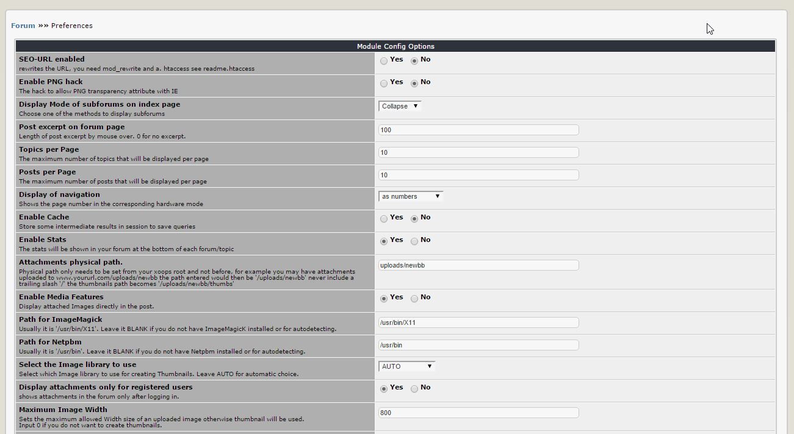

# 3.0 Настройки

В настройках Вы можете установить наиболее важные параметры для модуля, такие как количество видимых тем на странице.

  

**Фигура 12 Параметры настроек**

### Параметры конфигурации модуля

|Опции|Описание|
|---|---|
|SEO-URL включен |перезаписывает URL-адрес, Вам нужен mod_rewrite и .htaccess см. руководство по .htaccess	|
|Режим отображения подфорумов на главной странице|Выберите один из способов отображения подфорумов|
|Фрагмент сообщения на странице форума|Длинна фрагмента сообщения в фокусе мыши. 0 - не отображать.|
|Темы на страницу|Максимальное количество тем, отображаемых на странице|
|Сообщений на страницу|Максимальное количество сообщений, которые будут отображаться на странице|
|Показать навигацию|Показывает номер страницы в соответствии с выбранным режимом|
|Включить кеш|Сохранять некоторые промежуточные результаты в сеансе для сохранения запросов|
|Включить статистику|Статистика будет показана на Вашем форуме в нижней части каждого форума/темы|
|Физический путь для вложений.|Физический путь должен быть установлен только из корня xoops. Например, у Вас могут быть вложения, загруженные в www.yoururl.com/uploads/newbb введенный путь будет - '/uploads/newbb'. Не включать завершающую косую черту '/'. Путь для эскизов будет - '/uploads/newbb/thumbs'|
|Включить функции мультимедиа|Отображать прикрепленные изображения непосредственно в сообщении.|
|Путь для ImageMagick|Обычно это '/usr/bin/X11'. Оставьте его ПУСТЫМ, если у Вас нет установленного ImageMagicK или для автоопределения.|
|Путь для Netpbm|Обычно это '/usr/bin'. Оставьте его ПУСТЫМ, если у Вас нет Netpbm или для автоопределения.|
|Выберите библиотеку изображений, чтобы использовать|Выберите, какую библиотеку изображений использовать для создания миниатюр. Оставьте AUTO для автоматического выбора.|
|Отображать вложения только для зарегистрированных пользователей|показывает вложения на форуме только после входа в систему.|
|Максимальная ширина изображения|Устанавливает максимально допустимую Ширину загружаемого изображения, иначе будет использоваться эскиз. Введите 0, если Вы не хотите создавать эскизы.|
|Максимальная высота изображения|Устанавливает максимально допустимую высоту загруженного изображения.|
|Максимальная ширина изображения для создания эскиза|Устанавливает максимальную ширину загруженного изображения для создания эскиза. Изображение с шириной больше значения не будет использовать для эскизов.|
|Максимальная высота изображения для создания эскиза|Устанавливает максимальную высоту загруженного изображения для создания эскиза. Изображение с высотой, превышающей значение, не будет использовать для эскизов.|
|Показать кто на форуме|Включенный блок, будет показан внизу страницы форума|
|Режимы уровней HP/MP/EXP|HP определяет среднее количество сообщений в день. MP определяет соотношение даты регистрации к общему числу сообщений. EXP увеличивается с каждым сообщением и когда достигает 100%, повышается уровень, а EXP сбрасывается в 0.|
|Показать настоящее имя|Заменяет логин пользователя на реальное имя пользователя.|
|Включить панель группы|Показать группы пользователей в поле Информация о сообщении|
|Включить функцию рейтинга|Разрешить рейтинг темы|
|Сообщить модератору|Пользователь может отправлять сообщения Модератору(-ам), по какой-либо причине, которая позволяет Модератору(-ам) принять меры|
|Включить быстрый ответ|Это позволит получить форму быстрого ответа|
|Включить RSS-канал|Включить RSS-канал, изменить параметры ниже для элементов и длины описания|
|RSS Макс.||
|RSS Макс. Длинна описания||
|Время кэширования RSS-ленты|Время кэширования для повторной генерации RSS-канала в минутах.|
|Показать инфобокс|Инфобокс содержит информацию о пользователе (дата регистрации, количество сообщений, ...)|
|Показать ссылки на социальные сети|Показывать кнопки соцсетей в нижней части каждого сообщения. Позволяет пользователю поделиться содержимым в соцсети.|
|Показать рекламу|показывает коммерческий блок после 2-ого сообщения.|
|Включить меню быстрого перехода|Если включено, выпадающее меню позволит пользователям перейти на другой форум с форума или темы|
|Показать таблицу разрешений|Установите Да чтобы показать права пользователя|
|Интересные посты по Email|Установите период времени для отправки почтовой рассылки интересного пользователям|
|Показать IP пользователя|Установите Да, чтобы показать IP пользователя модераторам|
|Включить требование кармы|Это позволяет пользователю устанавливать количество сообщений, по достижении которого другие пользователи смогут читать его/ее сообщения|
|Варианты кармы для публикации|Используйте ',' как разделитель для нескольких опций.|
|'Поскольку' варианты окна выбора в 'viewform.php', 'list.topic.php' и 'search.php'|Положительное значение для дней и отрицательное значение в течение нескольких часов. Используйте ',' как разделитель для нескольких опций. (0=С начала) (365=С прошлого года)|
|'Поскольку' значение по умолчанию в поле выбора|Значение по умолчанию при котором будут показаны сообщения относительно даты публикации, если оно не указано пользователями. Положительное значение для дней и отрицательное значение в течение нескольких часов. (0=С начала) (365=С прошлого года)|
|Разрешить зарегистрированным пользователям отправлять анонимно|Это позволяет зарегистрированному пользователю анонимно размещать сообщения|
|Префикс для анонимного пользователя|Это добавит префикс анонимного пользователя во время публикации|
|Разрешить требовать ответа при чтении сообщения|Эта функция заставляет читателей отвечать на исходное сообщение, прежде чем читать оригинал|
|Ограничение времени для редактирования сообщения|Установите лимит времени для редактирования пользователем собственного сообщения. В минутах, 0 без ограничений|
|Ограничение времени для записи информации о редактировании|Установите лимит времени для отказа от записи. В минутах, 0 без ограничений|
|Ограничение времени для удаления сообщения|Установите ограничение по времени для пользователя, удаляющего свой собственный пост. В минутах, 0 без ограничений|
|Ограничение времени для следующей публикации|Установите ограничение по времени для следующей публикации. В секундах 0 без ограничений|
|Показать разрешения для редактирования|Показать разрешения на странице редактирования|
|Включить модерацию пользователя|Модератор форума может заблокировать конкретного пользователя на определенный период времени на форуме| 
|Показать отказ от ответственности||
|Отказ от ответственности|Введите свое заявление об отказе, которое будет показано для выбранного выше варианта.|
|Приветствие пользователя на форуме, при первом посещении|Если установлен ID форума будет создан персональный форум пользователя в указанном форуме.|
|Введите сообщение для впервые зашедшего пользователя|Сообщение будет опубликовано в первом сообщении пользователя, когда пользователь впервые зайдет на Форум|
|Модуль опроса|XoopsPoll или клон. Оставьте пустым для отключения.|
|Включение уведомлений|Этот модуль позволяет пользователям получать уведомления при наступлении определенных событий. Выберите, если пользователи должны быть представлены параметры уведомлений в блоке (Block-style), в модуле (Inline-style), или оба. Для получения уведомления block-style, блок параметров уведомлений должен быть включен для этого модуля.|
|Включение конкретных событий|Выберите, какие уведомления о событиях могут подписаться пользователи.|