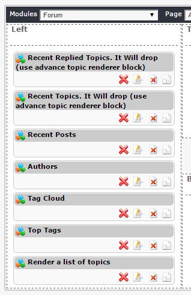

# 6.0 Блоки

NewBB имеет 6 блоков, доступных для использования:

|Блок|Описание|
|---|---|
|Последние ответы. По убыванию (используйте предварительный блок рендеринга темы)|Вы можете определить критерии выбора тем, например. последнее, большинство просмотров, большинство ответов, новые интересные. Вы также можете выбрать Форумы. |
|Последние темы. По убыванию (используйте предварительный блок рендеринга темы)|Вы можете определить критерии выбора тем, например. последнее, большинство просмотров, большинство ответов, новые интересные. Вы также можете выбрать Форумы. |
|Недавние посты|Показывает последние сообщения|
|Авторы|Показать авторов |
|Облако тегов|Показывает облако тегегов|
|Лучшие теги|Показывает лучшие теги форумов|
|Показать список тем|Показывает выбранные элементы темы в блоке IF. Пользователям будут видны в зависимости от установленных прав доступа |